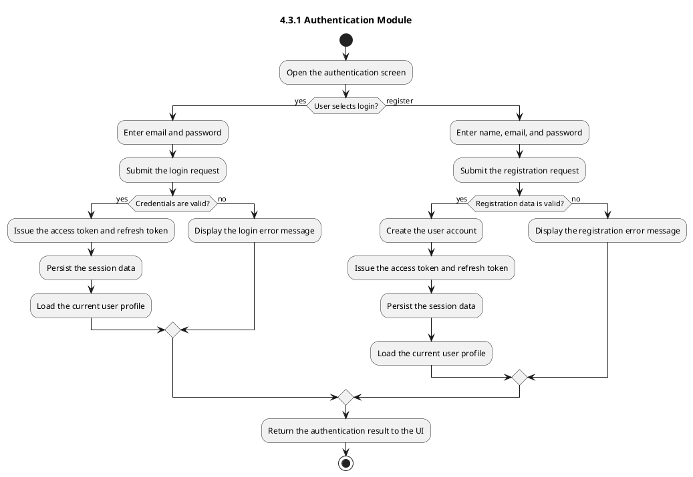
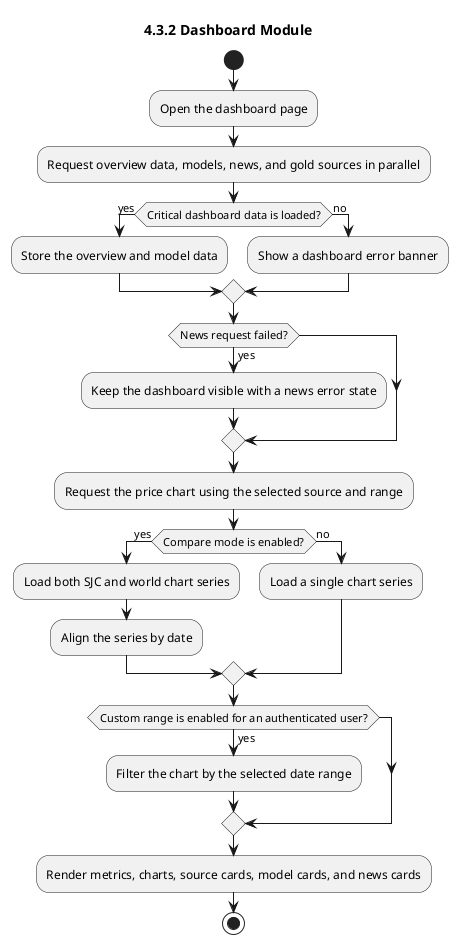
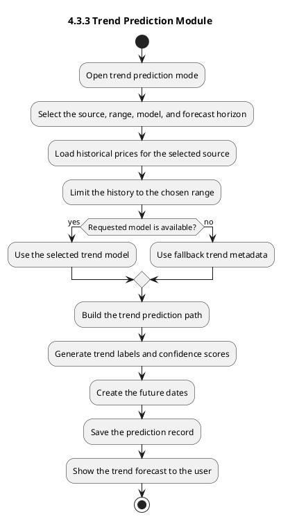
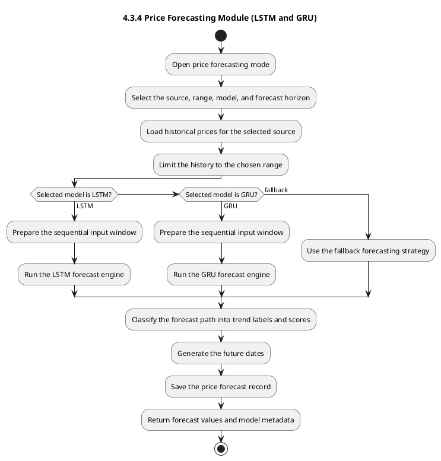
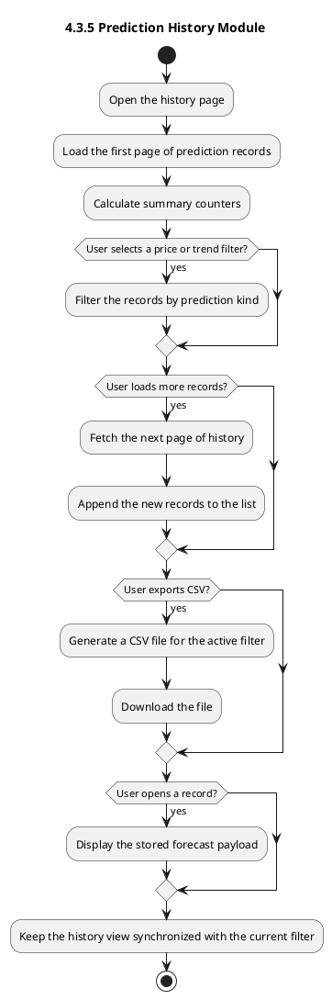
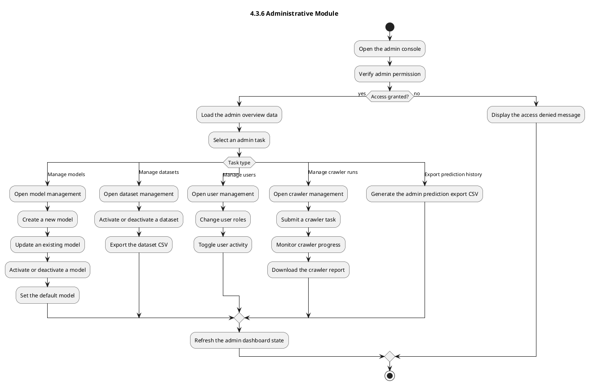
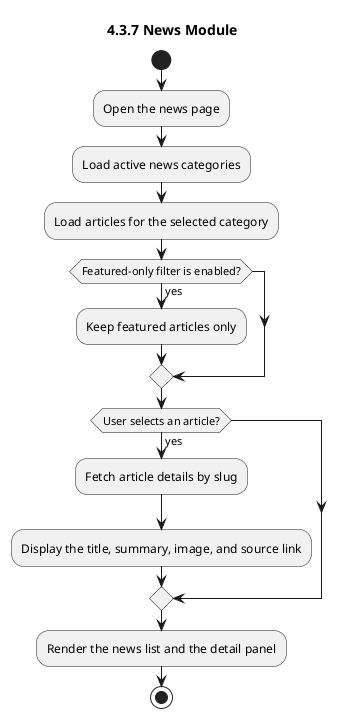
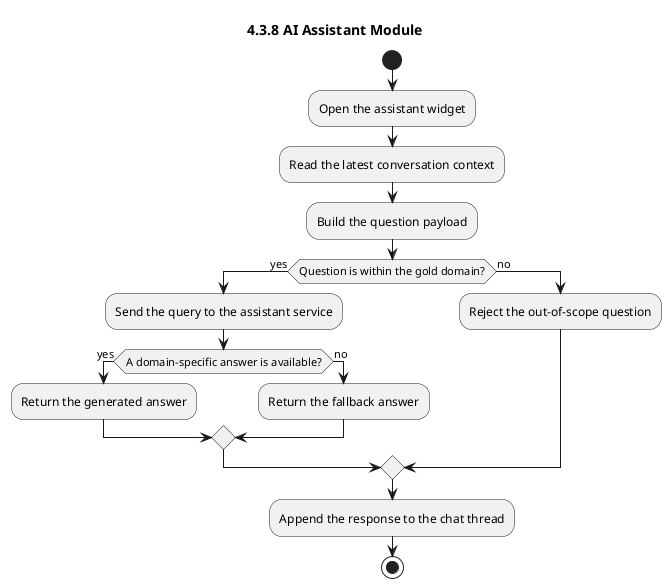

# Main Function Activity Diagrams

This document contains PlantUML activity diagrams for the main functions in the system.
All diagrams are written in English and each one ends with a single `stop` node.

## 4.3.1 Authentication Module

## 4.3.2 Dashboard Module

## 4.3.3 Trend Prediction Module

## 4.3.4 Price Forecasting Module (LSTM and GRU)

## 4.3.5 Prediction History Module

## 4.3.6 Administrative Module

## 4.3.7 News Module

## 4.3.8 AI Assistant Module

## Notes

- The dashboard diagram already includes the market overview flow because the application loads overview data, price charts, sources, models, and news on the same screen.
- The admin diagram covers model management, dataset management, user management, crawler runs, and prediction export because those are grouped under the administrative area in the codebase.